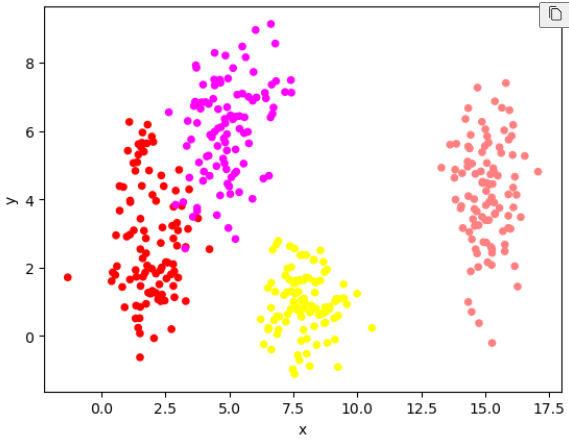
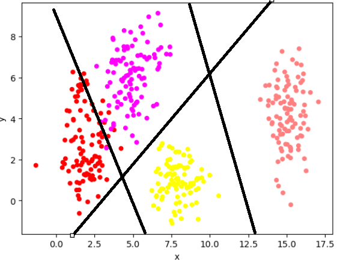
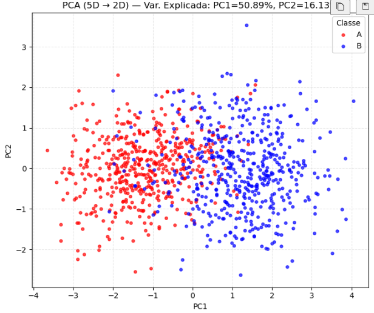
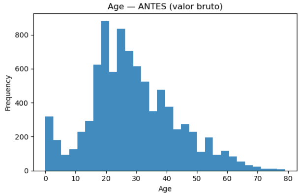
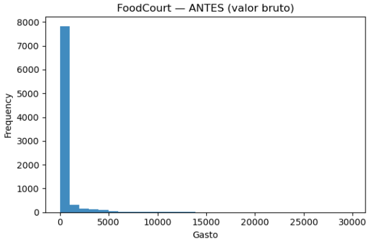
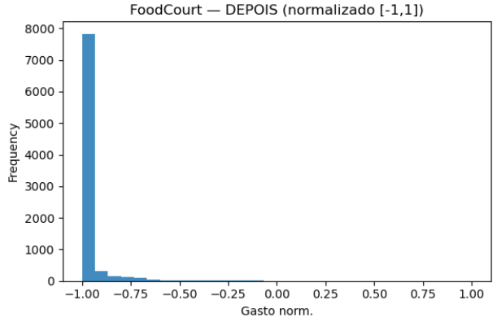

# Atividade: 1. Data

---


## Exercício 1 — *Exploring Class Separability in 2D*
## A brief description of my approach

Para gerar os dados, utilizo distribuições normais multivariadas com a função random.multivariate_normal do numpy, cada um com média e covariância diferentes. Cada ponto recebe um rótulo de classe correspondente ao cluster de origem.

## Generate  the data:

```python
data = {'x': [], 'y':[], 'class':[], 'color': []}


mean_std_dev = [([2,3], np.diag([0.8, 2.5])) ,
([5,6], np.diag([1.2, 1.9])),
([8,1], np.diag([0.9, 0.9])),
([15,4], np.diag([0.5, 2.0]))]
mean = [2, 3]
cov = np.diag([0.8, 2.5])
for i in range(0, 4):

    mean = mean_std_dev[i][0]
    cov = mean_std_dev[i][1]

    x, y = np.random.multivariate_normal(mean, cov, 100).T
    classe = []
    for c in range(0, len(x)):
        data['x'].append(x[c])
        data['y'].append(y[c])
        data['class'].append(f"class_{i}")
        if i == 0:
            data['color'].append((1.0, 0.0, 0.0))
        if i == 1:
            data['color'].append((1.0,0.0,1.0,))
        if i == 2:
            data['color'].append((1.0, 1.0, 0.0))
        if i == 3:
            data['color'].append((1.0, 0.5, 0.5))
```

### Ploting the Data


### Analyze and Draw Boundaries
a .No gráfico de dispersão, observa-se que as duas classes mais à direita (rosa claro) estão bem separadas das demais, sem sobreposição aparente. Já as duas classes mais à esquerda (vermelha e roxa) apresentam considerável sobreposição em suas regiões, tornando difícil distingui-las linearmente. A classe amarela encontra-se abaixo, relativamente bem delimitada, embora mais próxima das classes vermelha e roxa.

b. Observando o plot, seriam necessárias três fronteiras lineares para separar corretamente todas as classes. Com apenas uma, seria possível dividir em metades (esquerda e direita), mas cada lado ainda conteria duas classes. Com duas fronteiras, ainda restaria um lado com duas classes agrupadas. Assim, somente com uma terceira linha seria possível separar essas duas classes restantes.


c.


---

## Exercício 2 — *Non-Linearity in Higher Dimensions*

## A brief description of my approach

Para geras os dados em cinco dimensões foi utilizados distribuições normais multivariadas, cada um com atributos diferentes. Cada amostra recebeu um rotulo de classe (A ou B), dependendo da origem dela.

## Generate  the data:

```python
import numpy as np
import pandas as pd

rng = np.random.default_rng(42)
data = {
    'x1': [], 'x2': [], 'x3': [], 'x4': [], 'x5': [],
    'class': [], 'color': []
}
params = [
    (
        np.array([0.0, 0.0, 0.0, 0.0, 0.0]),
        np.array([
            [1.0, 0.8, 0.1, 0.0, 0.0],
            [0.8, 1.0, 0.3, 0.0, 0.0],
            [0.1, 0.3, 1.0, 0.5, 0.0],
            [0.0, 0.0, 0.5, 1.0, 0.2],
            [0.0, 0.0, 0.0, 0.2, 1.0],
        ]),
        "class_A",
        (1.0, 0.0, 0.0), 
    ),
    (
        np.array([1.5, 1.5, 1.5, 1.5, 1.5]),
        np.array([
            [1.5, -0.7, 0.2, 0.0, 0.0],
            [-0.7, 1.5, 0.4, 0.0, 0.0],
            [0.2, 0.4, 1.5, 0.6, 0.0],
            [0.0, 0.0, 0.6, 1.5, 0.3],
            [0.0, 0.0, 0.0, 0.3, 1.5],
        ]),
        "class_B",
        (0.0, 0.0, 1.0), 
    ),
]

n_per_class = 500

for mean, cov, label, color in params:
    samples = rng.multivariate_normal(mean, cov, size=n_per_class)
    for s in samples:
        data['x1'].append(s[0])
        data['x2'].append(s[1])
        data['x3'].append(s[2])
        data['x4'].append(s[3])
        data['x5'].append(s[4])
        data['class'].append(label)
        data['color'].append(color)


df = pd.DataFrame(data)

```

### Visualize the data 



### Analyze the plot

a. Observando o gráfico, percebe-se que os pontos vermelhos tendem a se concentrar mais à esquerda, enquanto os azuis ficam predominantemente à direita. No entanto, há uma sobreposição considerável: vários pontos vermelhos aparecem em regiões azuis e vice-versa. Isso significa que uma simples linha no meio do gráfico não conseguiria separar as classes com boa acurácia, já que há mistura entre elas.

b. Esse tipo de dado impõe um desafio, pois um modelo linear teria dificuldade em capturar esses casos de sobreposição. Seriam necessárias múltiplas fronteiras lineares para tentar contornar o problema, o que aumenta o risco de overfitting. Por isso, uma rede neural com múltiplas camadas e funções de ativação não lineares se mostra mais adequada, já que consegue modelar fronteiras de decisão complexas e lidar melhor com regiões de interseção entre as classes.


---

## Exercício 3 — *Preparing Real-World Data for a Neural Network*


## A brief description of my approach

Carrego o dataset e realizo o tratamento dos valores faltantes, usando a mediana para variáveis numéricas, a moda para variáveis binárias e preenchendo as categóricas com "Unknown".

Em seguida, aplico one-hot encoding nas variáveis categóricas e normalizo os atributos numéricos para a faixa [-1, 1].

### Describe the Data

- O objetivo do dataset "Spaceship Titanic" é prever se os passageiros foram transportados para outra dimensão. A coluna "Transported" representa esse resultado: valor 1 indica que o passageiro foi transportado e valor 0 indica que não foi.

- Features numéricas: Age, RoomService, FoodCourt, ShoppingMall, Spa, VRDeck.
- Features categóricas: PassengerId, HomePlanet, CryoSleep, Cabin, Destination, VIP, Name.

- Valores faltantes por coluna:

| Coluna        | Nº de faltantes |
|---------------|-----------------|
| CryoSleep     | 217             |
| ShoppingMall  | 208             |
| VIP           | 203             |
| HomePlanet    | 201             |
| Name          | 200             |
| Cabin         | 199             |
| VRDeck        | 188             |
| FoodCourt     | 183             |
| Spa           | 183             |
| Destination   | 182             |
| RoomService   | 181             |
| Age           | 179             |

### Preprocess the Data
```python
def report_missing(df):
    miss = df.isna().sum()
    miss = miss[miss > 0].sort_values(ascending=False)
    print("\nFaltantes por coluna:\n" + (miss.to_string() if len(miss) else "Nenhum"))
    return miss

def one_hot_manual(series, prefix=None):
    s = series.astype("category")
    cats = list(s.cat.categories)
    out = pd.DataFrame(index=series.index)
    for c in cats:
        col = f"{prefix or series.name}__{c}"
        out[col] = (s == c).astype(int)
    return out

def minmax_pm1_df(df, cols):
    mn = df[cols].min(axis=0)
    mx = df[cols].max(axis=0)
    denom = (mx - mn).replace(0, 1.0)
    scaled = 2 * ((df[cols] - mn) / denom) - 1
    return scaled, mn, mx


def prepare_spaceship_norm(path=CSV_PATH):
    df = pd.read_csv(path)
    print("Carregado:", path, "shape:", df.shape)

    num_cols = ["Age", "RoomService", "FoodCourt", "ShoppingMall", "Spa", "VRDeck"]
    bin_cols = ["CryoSleep", "VIP"]           
    cat_cols = ["HomePlanet", "Destination"]   
    target = "Transported"
    for c in num_cols:
        df[c] = pd.to_numeric(df[c], errors="coerce")

    y = df[target].astype(int)

    report_missing(df)
    for c in num_cols:
        df[c] = df[c].fillna(df[c].median())
    for c in bin_cols:
        m = df[c].mode(dropna=True)
        fill = m.iloc[0] if len(m) else False
        df[c] = df[c].fillna(fill).map({True: 1, False: 0}).astype(int)
    for c in cat_cols:
        df[c] = df[c].fillna("Unknown").astype(str)

    oh_parts = [one_hot_manual(df[c], prefix=c) for c in cat_cols]
    X_cat = pd.concat(oh_parts, axis=1)
    X_num_scaled, mn, mx = minmax_pm1_df(df, num_cols)

    X = pd.concat([X_num_scaled[num_cols], df[bin_cols].astype(int), X_cat], axis=1)
    print("Features finais:", X.shape)

    plt.figure(figsize=(6,4)); df["Age"].plot.hist(bins=30, alpha=0.85)
    plt.title("Age — ANTES (valor bruto)"); plt.xlabel("Age"); plt.tight_layout()

    plt.figure(figsize=(6,4)); X_num_scaled["Age"].plot.hist(bins=30, alpha=0.85)
    plt.title("Age — DEPOIS (normalizado [-1,1])"); plt.xlabel("Age norm."); plt.tight_layout()

    plt.figure(figsize=(6,4)); df["FoodCourt"].plot.hist(bins=30, alpha=0.85)
    plt.title("FoodCourt — ANTES (valor bruto)"); plt.xlabel("Gasto"); plt.tight_layout()

    plt.figure(figsize=(6,4)); X_num_scaled["FoodCourt"].plot.hist(bins=30, alpha=0.85)
    plt.title("FoodCourt — DEPOIS (normalizado [-1,1])"); plt.xlabel("Gasto norm."); plt.tight_layout()

    plt.show()
    return X, y, {"min": mn, "max": mx}
```
### Visualize the Results

<div style="display: flex; justify-content: space-around;">
  
  
</div>
<div style="display: flex; justify-content: space-around;">
  
  
</div>

## Referências

- Descrição do *Spaceship Titanic* e do alvo `Transported`: https://www.kaggle.com/competitions/spaceship-titanic/data.  

