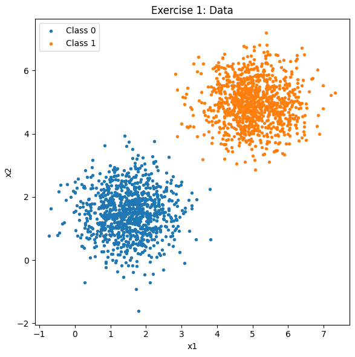

# Atividade: 2. Perceptron

---
## Exercício 1
## A brief description of my approach

Para gerar os dados utilizo a função `multivariate_normal`, que permite passar o vetor de médias e a matriz de covariância para aplicar a distribuição `Gaussiana` multivariada. Em seguida, aplico um vstack para formar o vetor X, empilhando os arrays verticalmente, enquanto para o vetor y utilizo um hstack, que os empilha horizontalmente.

Na implementação do Perceptron, crio um loop externo para limitar o número máximo de épocas, caso não ocorra a convergência. Dentro desse loop, antes de entrar no interno, inicializo as variáveis updates e correct com zero. No loop interno, verifico se ocorre algum erro; em caso positivo, recalculo os pesos e o viés. Caso não ocorra nenhum erro durante toda a época, significa que houve convergência, e o loop é interrompido.

## Generate  the data:

```python

mean_class0 = np.array([1.5, 1.5])
mean_class1 = np.array([5.0, 5.0])
cov   = np.array([[0.5, 0.0],[0.0, 0.5]])
X_class0 = rng.multivariate_normal(mean_class0, cov, size=samples_per_class)
X_class1 = rng.multivariate_normal(mean_class1, cov, size=samples_per_class)
X  = np.vstack([X_class0, X_class1])
y  = np.hstack([np.zeros(samples_per_class, dtype=int), np.ones(samples_per_class,  dtype=int)])

```

### Ploting the Data


### Perceptron Implementation Task:

```python

r=0.01 
max_epochs=100 


rng = np.random.default_rng(seed)
n, d = X.shape
w = np.zeros(d)
b = 0.0
acc_hist = []

for epoch in range(1, max_epochs+1):
    idx = np.arange(n)

    rng.shuffle(idx)
    updates = 0
    correct = 0

    for i in idx:
        z = np.dot(w, X[i]) + b
        y_hat = 1 if z >= 0 else 0
        e = y[i] - y_hat 
        if e != 0:
        
            w = w + lr * e * X[i]
            b = b + lr * e
            updates += 1
        else:
            correct += 1

        acc = correct / n
        acc_hist.append(acc)

        if updates == 0:
            break

```

### Reporting results

- Pesos finais w: [0.04894919 0.06400311]
- Viés final b: -0.3200000000000001
- acurácia final: 99.60%

Para entender o motivo da convergência rápida, é necessário explicar que o Perceptron funciona com uma regra de atualização: sempre que um ponto é classificado incorretamente, os pesos são ajustados na direção correta para reduzir o erro. Neste caso, como há uma separabilidade linear clara entre as classes, o algoritmo atinge a convergência rapidamente, pois não há necessidade de muitas atualizações para encontrar uma fronteira de decisão adequada.


## Exercício 2

## A brief description of my approach

Neste exercício os dados são gerados da mesma forma que no primeiro, mas o Perceptron é treinado em 5 execuções com inicializações diferentes. Para cada execução registro a acurácia por época e, ao final, calculo a média e o desvio-padrão das acurácias, alinhando os históricos quando necessário. Isso permite avaliar o desempenho médio do modelo em dados com sobreposição e reduzir a influência da inicialização aleatória.

## Data Generation Task:

```python
mean_class0 = np.array([3.0, 3.0])
mean_class1 = np.array([4.0, 4.0])
cov   = np.array([[1.5, 0.0],[0.0, 1.5]])
X_class0 = rng.multivariate_normal(mean_class0, cov, size=samples_per_class)
X_class1 = rng.multivariate_normal(mean_class1, cov, size=samples_per_class)
X  = np.vstack([X_class0, X_class1])
y  = np.hstack([np.zeros(samples_per_class, dtype=int), np.ones(samples_per_class,  dtype=int)])

```

### Visualize the data 


### Perceptron implementation task

```python
num_runs = 5
all_hist = []
final_accs = []
final_ws = []
final_bs = []

for run in range(num_runs):
    local_rng = np.random.default_rng(100 + run)

    w_r = local_rng.normal(0, 0.01, size=X.shape[1])
    b_r = 0.0

    acc_hist_r = []
    idx = np.arange(y.shape[0])

    for epoch in range(1, 101):  
        local_rng.shuffle(idx)
        updates = 0
        correct = 0

        for i in idx:
            xi = X[i]
            yi = y[i]
            z  = float(np.dot(w_r, xi) + b_r)
            yhat = 1 if z >= 0 else 0
            err  = int(yi - yhat)

            if err != 0:
                w_r = w_r + 0.01 * err * xi
                b_r = b_r + 0.01 * err
                updates += 1
            else:
                correct += 1

        acc = correct / len(y)
        acc_hist_r.append(acc)

        if updates == 0:  
            break

   
    all_hist.append(acc_hist_r)
    y_pred_r = ((X @ w_r + b_r) >= 0).astype(int)
    final_accs.append((y_pred_r == y).mean())
    final_ws.append(w_r.copy())
    final_bs.append(b_r)


max_len = max(len(h) for h in all_hist)
aligned = []
for h in all_hist:
    if len(h) < max_len:
        h = h + [h[-1]] * (max_len - len(h))
    aligned.append(h)

aligned = np.array(aligned)
mean_acc = aligned.mean(axis=0)
std_acc  = aligned.std(axis=0)


for i in range(num_runs):
    print(f"Run {i+1}:")
    print(f"  Final weights: {final_ws[i]}")
    print(f"  Final bias: {final_bs[i]}")
    print(f"  Final accuracy: {final_accs[i]*100:.2f}%")
    print()

print("Summary across runs:")
print("  Final accuracies:", [f"{a*100:.2f}%" for a in final_accs])
print(f"  Mean final accuracy: {np.mean(final_accs)*100:.2f}%")
print(f"  Std final accuracy: {np.std(final_accs)*100:.2f}%")

```

### Reporting results

Run 1:
  Final weights: [-0.02059995  0.1328929 ]
  Final bias: -0.43000000000000016
  Final accuracy: 63.00%

Run 2:
  Final weights: [0.05533817 0.05429294]
  Final bias: -0.42000000000000015
  Final accuracy: 69.65%

Run 3:
  Final weights: [0.05812441 0.09586418]
  Final bias: -0.41000000000000014
  Final accuracy: 64.50%

Run 4:
  Final weights: [0.00919726 0.05628983]
  Final bias: -0.43000000000000016
  Final accuracy: 50.45%

Run 5:
  Final weights: [0.13061734 0.03119603]
  Final bias: -0.41000000000000014
  Final accuracy: 60.85%

Summary across runs:
  Final accuracies: ['63.00%', '69.65%', '64.50%', '50.45%', '60.85%']
  Mean final accuracy: 61.69%
  Std final accuracy: 6.32%


Esses dados, diferentemente do primeiro caso, não apresentam uma separabilidade linear clara, como pode ser observado na imagem. Isso torna difícil para o Perceptron alcançar a convergência, pois sempre haverá pontos que não podem ser separados corretamente por uma única reta. Assim, o algoritmo permanece ajustando os pesos e o viés a cada época, sem conseguir estabilizar em uma solução perfeita.

---

