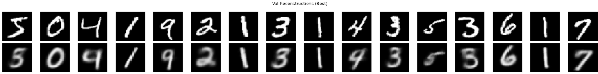
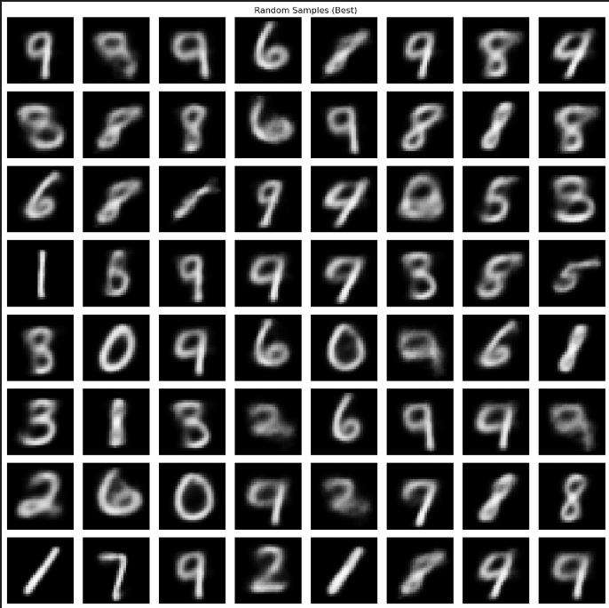
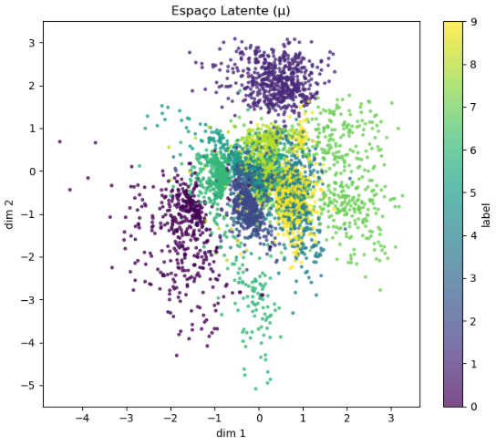

#  Resultados e Análise — VAE (Variational Autoencoder)

##  Resumo dos Resultados

O modelo **Variational Autoencoder (VAE)** foi treinado no dataset **MNIST** com 20 épocas, utilizando uma arquitetura totalmente conectada (MLP) e um espaço latente bidimensional (`LATENT_DIM = 2`).  
O objetivo foi aprender uma representação comprimida das imagens de dígitos e gerar novas amostras coerentes com os dados originais.

Durante o treinamento, observou-se a convergência estável das perdas **BCE (reconstrução)** e **KL (regularização)**.  
A perda de reconstrução diminuiu consistentemente, indicando que o modelo aprendeu a reproduzir bem as entradas, enquanto a divergência KL estabilizou, refletindo o aprendizado de uma distribuição latente regularizada.

---

##  Reconstruções

As imagens abaixo mostram os dígitos originais (linha superior) e suas respectivas reconstruções (linha inferior) feitas pelo VAE após o treinamento.

 **Análise:**  
As reconstruções são bastante fiéis aos dígitos originais. Pequenas regiões borradas aparecem em dígitos mais complexos (como 3 e 8), o que é esperado dado o uso de uma rede MLP simples e o baixo tamanho do espaço latente (2D).

---

##  Amostras Aleatórias do Espaço Latente

O modelo também foi avaliado em sua capacidade generativa, amostrando vetores `z ~ N(0, I)` e decodificando-os em imagens.

 **Análise:**  
As imagens sintetizadas são coerentes e diversas, reproduzindo diferentes dígitos com boa qualidade visual.  
Alguns exemplos apresentam leve borramento — um indicativo de sobreposição de regiões no espaço latente, algo esperado com `LATENT_DIM = 2`.

---

## Espaço Latente

A figura abaixo mostra o **espaço latente** aprendido, utilizando as médias `μ` geradas pelo encoder. Cada ponto representa uma imagem, colorido de acordo com sua classe (dígito de 0 a 9).

**Análise:**  
O gráfico evidencia que o VAE conseguiu **organizar o espaço latente de forma estruturada**, separando diferentes classes em regiões distintas.  
Mesmo com apenas duas dimensões, é possível observar **clusters bem definidos** (por exemplo, dígitos 0, 1 e 7 aparecem claramente isolados).

---

## Desafios e Aprendizados

### **Desafios enfrentados**
- Compatibilidade de versões entre **TensorFlow**, **NumPy** e **Python 3.12** durante a instalação.  
- Ajuste do **espaço latente (dimensão 2)**: dimensões muito pequenas reduzem a qualidade das reconstruções, mas são ideais para visualização.  
- Balancear as perdas **BCE** e **KL**: um valor alto de KL pode levar a amostras menos nítidas, enquanto valores baixos reduzem a diversidade gerada.

### **Insights obtidos**
- Mesmo com uma arquitetura simples (MLP), o VAE é capaz de **aprender distribuições latentes significativas** e **gerar novos exemplos realistas**.  
- O espaço latente 2D permite **interpretabilidade visual**: é possível entender como os diferentes dígitos se distribuem e se relacionam.  
- A regularização KL é fundamental para que o modelo aprenda uma **distribuição contínua e suave**, essencial para a geração de novas amostras.

---

## Conclusão

O experimento demonstra o funcionamento prático de um **Variational Autoencoder**, mostrando:
- **Reconstrução fiel das imagens originais**,  
- **Capacidade generativa realista**,  
- **Organização semântica no espaço latente**.

